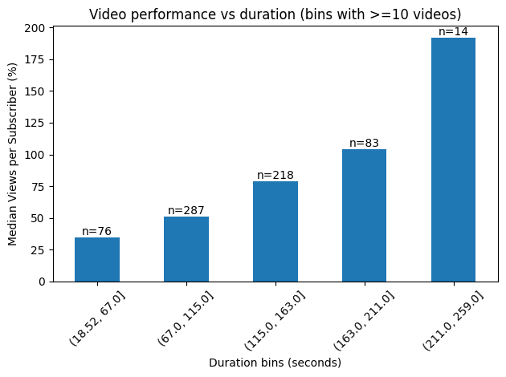
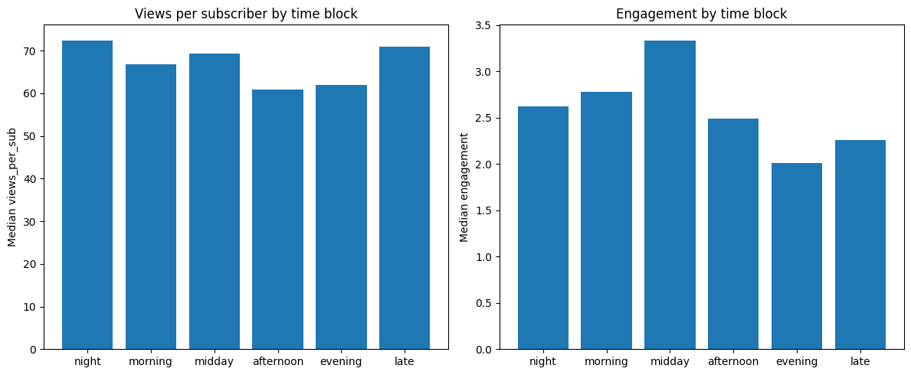
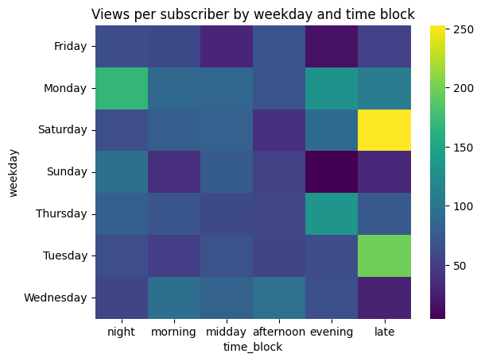

# TikTok Political Content Analysis (Vietnamese Segment)

The analysis is conducted in order to identify the most probable **formula for a successful TikTok video** on politics and international relations in the Vietnamese content ecosystem.

The dataset was collected from three successful creators that regularly publish content within this niche:

- **luuluongchiasenews**
- **stevent107**
- **bankerthichcode**

From each creator's page metadata was collected for approximately **the last 230 videos**, resulting in a dataset of roughly **700 videos**.

## Dataset

The data includes the following variables for each video:

- **title** — video title
- **caption** — video caption
- **num_views** — number of views
- **likes** — number of likes
- **comments** — number of comments
- **shares** — number of shares
- **duration** — duration of the video
- **create_time_unix** — time and date of posting

Additionally, several derived metrics were calculated:

- **engagement_rate**

```

engagement_rate = ((likes + comments + shares) / num_views) * 100

```

- **views_per_sub**

```

views_per_sub = num_views / subs * 100

```

- **comment_rate**

```

comment_rate = comments / num_views * 100

```

- **share_rate**

```

share_rate = shares / num_views * 100

```

- **like_rate**

```

like_rate = likes / num_views * 100

```

These indicators allow comparison of videos independently from the absolute audience size of the creators.

---

# "Ideal" Duration



Video length does not appear to have a strong negative effect on performance.

However, most videos cluster within the **67–163 seconds range**, which can be considered a practical **sweet spot** for political commentary content.

This duration is long enough to provide a short narrative or explanation but short enough to maintain viewer retention.

---

# "Ideal" Hook

Analysis of labeled hook types suggests that the most effective opening structures follow a small number of recurring patterns.

| Hook Type | Description | Performance Characteristics |
|-----------|-------------|-----------------------------|
| **Shocking Fact** | A surprising or alarming claim presented as factual information | Highest engagement. Encourages immediate curiosity and shares |
| **Contradiction** | Challenging a common belief ("People think X, but actually Y") | Generates debate and comments |
| **Statement** | Strong declarative statement about a political event | Stable performance |
| **Question** | Direct question to viewers | Encourages comments but slightly lower engagement overall |

**Most effective hook:**

```

Shocking fact + geopolitical topic

```

Example structure:

> "Ít ai biết rằng..."  
> ("Few people know that...")

or

> "Thực ra câu chuyện này phức tạp hơn nhiều..."  
> ("Actually this story is much more complicated...")

This structure creates **immediate curiosity**, which improves watch time.

---

# "Ideal" Emotion

Videos consistently rely on **high-arousal emotional triggers**.

| Emotion | Role in Engagement |
|--------|--------------------|
| **Surprise** | Most powerful driver of engagement. Often tied to unexpected geopolitical facts |
| **Patriotism** | Strong engagement when connected to Vietnam’s strength or historical achievements |
| **Curiosity** | Used in explanatory or analytical videos |
| **Outrage** | Drives comment sections and debate |
| **Fear / Threat** | Used when discussing geopolitical conflict or military power |

The most effective emotional combination appears to be:

```

Surprise + Patriotism

```

Example narrative pattern:

1. Introduce surprising geopolitical information
2. Connect it to Vietnam’s strategic position or national strength
3. End with a strong interpretive statement

---

# Topic Analysis

The majority of successful videos fall into a limited number of topic clusters.

| Topic Category | Description | Typical Emotional Trigger |
|----------------|-------------|---------------------------|
| **International conflicts** | Coverage of wars or geopolitical tensions (e.g. Iran, Ukraine) | Surprise / Fear |
| **Military power comparisons** | Analysis of weapons, armies, or defense capabilities | Patriotism |
| **Historical narratives** | Vietnamese historical events or anniversaries | Patriotism |
| **Political controversy** | Debates around ideology or social topics | Outrage |
| **Curiosity-driven discoveries** | Unexpected historical or archaeological discoveries | Surprise |

High-performing content frequently combines **global geopolitical events with Vietnamese national framing**.

Example:

```

Global conflict → explanation → implications for Vietnam

```

---

# Viral Structure Analysis

Across the dataset, successful videos follow a similar narrative structure.

**Typical viral structure:**

1️⃣ **Hook (0–3 seconds)**  
Shocking fact or surprising geopolitical claim

2️⃣ **Context (3–20 seconds)**  
Brief explanation of the event

3️⃣ **Interpretation (20–60 seconds)**  
Creator explains why the event matters

4️⃣ **Conclusion (final seconds)**  
Strong statement reinforcing the main message

Example simplified formula:

```

Trend topic

* surprising fact
* simplified geopolitical explanation
* strong confident conclusion

```

This structure balances **information delivery with emotional engagement**.

---

# "Ideal" Posting Time

The data suggests that posting time influences performance differently depending on the metric measured.



Engagement appears to be **significantly higher for videos posted at midday**, likely due to increased viewer interaction during lunch breaks.

However, the **highest number of views** tends to occur for videos posted **late in the evening**.



### Suggested optimal posting time for engagement

- **Tuesday — 13:00**
- **Thursday — 13:00**
- **Saturday — 22:00**

### Suggested optimal posting time for maximum views

- **Tuesday — 22:00**
- **Thursday — 22:00**
- **Saturday — 22:00**

However, these findings require **further validation**, as posting time alone may not be a decisive factor in video performance.

More likely, **topic relevance and emotional framing dominate the outcome**.

---

# Preliminary Formula for a Successful Video

Based on the dataset, the most probable formula for a successful Vietnamese political TikTok video is:

```

Trending geopolitical topic

* shocking hook
* surprise emotion
* simple narrative explanation
* confident conclusion
* 60–150 second duration
* evening posting time

```